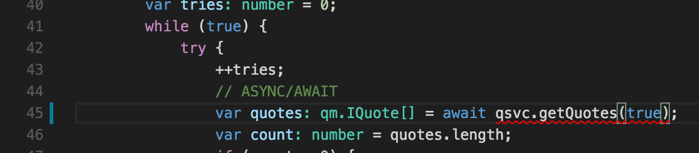

# Sane Node Development

Create a sample service which illustrates sane node development avoiding some of the historic problems.

## Eliminate Callback Hell  

Use async/await along with promises to write logical sane linear code while still maintaining the benefits of async execution

For example, in this example, the second insert doesn't occur until after the first one completes.

```javascript
public async initialize() {
    // insert some sample data for the demo
    
    await this._store.insert<IQuote>(<IQuote>{ 
        "quote": "Don't cry because it's over, smile because it happened.",
        "author": "Dr. Seuss"}
    );

    await this._store.insert<IQuote>(<IQuote>{ 
        "quote": "Be yourself; everyone else is already taken.",
        "author": "Oscar Wilde"}
    );
}
```

An example which would be much harder to accomplish with callbacks.  
Notice async calls inside of loops, sequential code and easy try/catch error handling  

```javascript
var tries: number = 0;
while (true) {
    try {
        ++tries;
        // ASYNC/AWAIT
        var quotes: qm.IQuote[] = await qsvc.getQuotes();
        var count: number = quotes.length;
        if (count > 0) {
            var randIndex: number = Math.floor(Math.random() * count);
            var quote = quotes[randIndex];
            res.send(quote);
        }
        else {
            res.status(404).send({ message: 'no quotes to pick from'});
        }
        break;
    }
    catch (err) {
        if (tries == 3) { throw err; }
        console.log('Retrying ...');
    }
}
```

## Compile time support  

When working in a non-trivial code base, compile time errors are critical for early detection.

I've worked in code bases where it was manageable but became very problematic on that first big refactor.

```bash
$ tsc
app.ts(45,49): error TS2346: Supplied parameters do not match any signature of call target. 
```

Also apparent with intellisense.  In this case using [VS Code](https://code.visualstudio.com)  



## Debug

Illustrate how to debug

## Highly Testable and Tested

Factor code in a way to ensure all paths are testable and tested.

## API

[Api Service Here](api/README.md)

## Front End

TODO